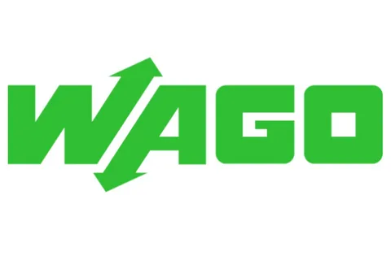
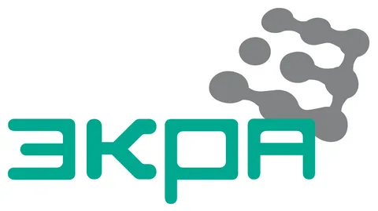

### Языки и инструменты

&nbsp;
&nbsp;
&nbsp;
&nbsp;
&nbsp;
&nbsp;
&nbsp;

### Автоматизация технологических процессов
&nbsp;
&nbsp;
&nbsp;
&nbsp;
&nbsp;
&nbsp;
&nbsp;
&nbsp;

### Проводил пусконаладку АСУ ТП на таких объектах как
&nbsp;
&nbsp;
&nbsp;

> ---

